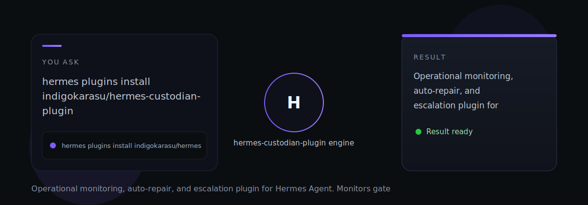

# hermes-custodian-plugin

hermes-custodian-plugin — Operational monitoring, auto-repair, and escalation plugin for Hermes Agent. Monitors gateway logs, cron jobs, skill journals, and OCAS data directories.

> Tell it what you need. It does the work.

## How it works

- **4 lifecycle hooks**: post_tool_call, on_session_start, on_session_end, on_session_reset
- **3 registered tools**: custodian_status, custodian_scan, custodian_issues
- **14 slash commands**: /custodian status, /custodian scan light, /custodian scan deep, /custodian issues list, /custodian issues resolve <id>, /custodian repair auto, /custodian repair plan, /custodian verify <fix_id>, /custodian schedule show, /custodian confidence show, /custodian init, /custodian update, /custodian escalation-runner
- **21 known issue fingerprints** matched against gateway logs, cron journals, and OCAS data
- **Confidence model** with auto tier promote/demote based on fix effectiveness
- **15 Tier 1 auto-fixes** applied during quiet hours
- **4 registered cron jobs**: light scan, deep scan, escalation runner, self-update
- **Dashboard panel** with status toggle, issue list, confidence scores, and quick actions

---

*hermes-custodian-plugin is part of the [OCAS Agent Suite](https://github.com/indigokarasu).*